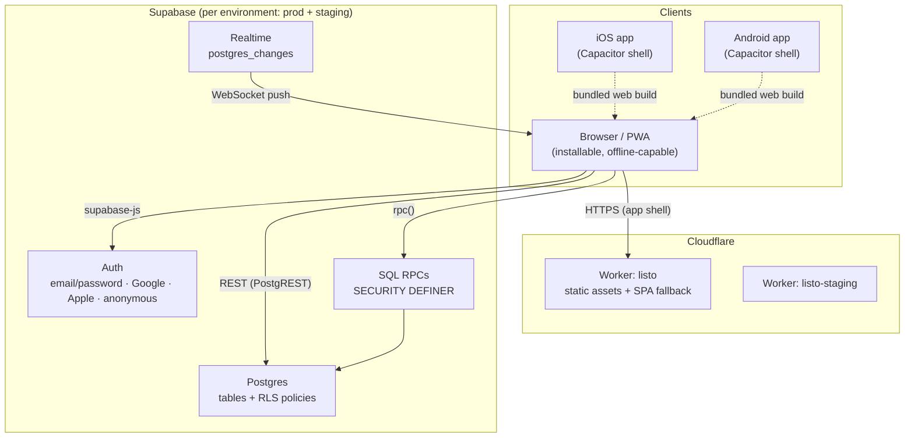
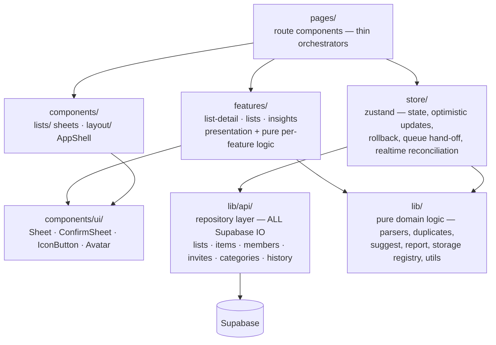
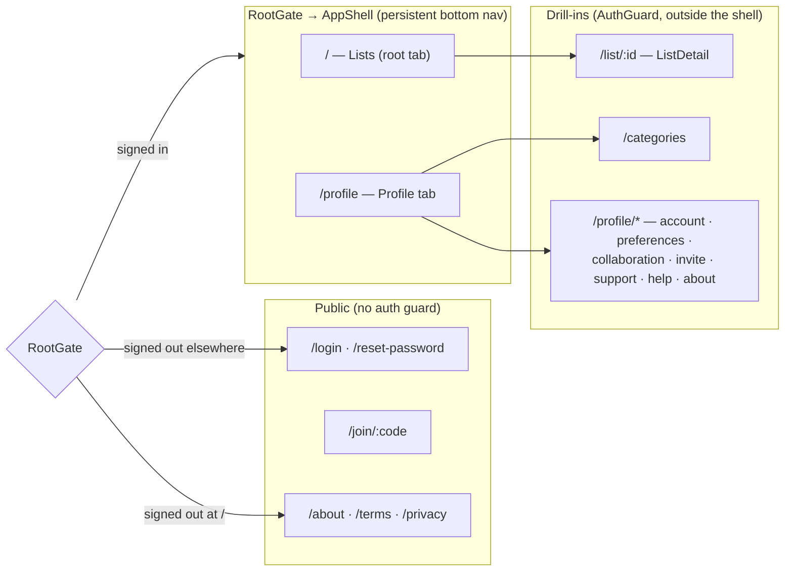
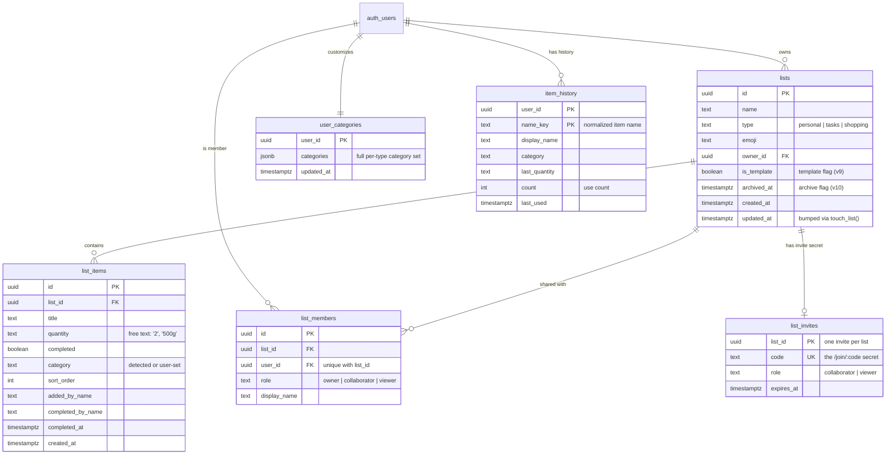
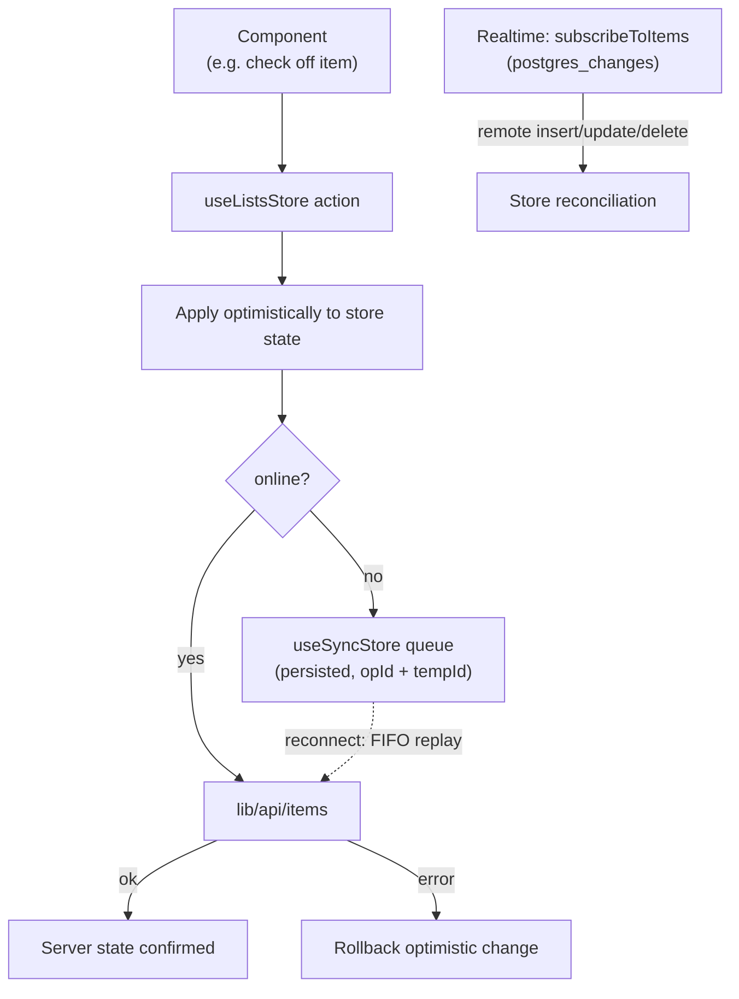
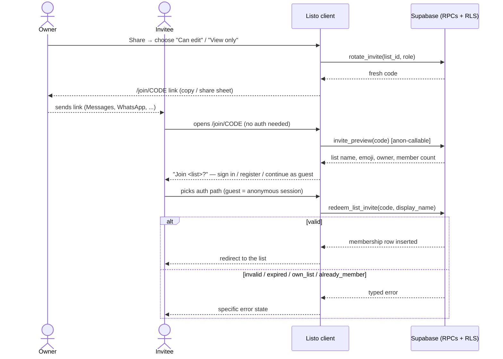
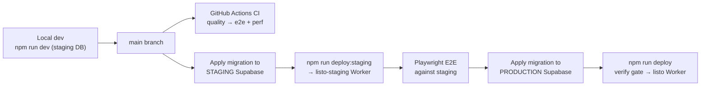

# Listo — Technical Documentation

The consolidated technical reference for Listo: system architecture, data
model, and the key runtime flows, with diagrams. Companion docs go deeper on
individual areas:

- [`ARCHITECTURE.md`](../ARCHITECTURE.md) — layer rules and coding conventions
- [`IMPLEMENTATION.md`](../IMPLEMENTATION.md) — per-feature implementation notes
- [`DEPLOYMENT.md`](../DEPLOYMENT.md) — environments, release process, CI/CD
- [`TESTING.md`](../TESTING.md) — quality gates and test strategy
- [`AUTH.md`](AUTH.md) — session lifecycle and auth flows

Diagrams are [Mermaid](https://mermaid.js.org/) — GitHub renders them inline.

---

## 1. System overview

Listo is a client-heavy PWA: a React single-page app served as static assets
from a Cloudflare Worker, with **Supabase as the entire backend** (Postgres,
Auth, Realtime, and SQL RPCs). There is no application server — row-level
security and `SECURITY DEFINER` functions are the server-side logic. The same
web build ships inside Capacitor shells for iOS and Android.

Key consequences of this shape:

- **The database is the trust boundary.** The client mirrors permissions in
  the UI, but every table has RLS policies that hold even if the client is
  bypassed. Privileged operations (invite redemption, role changes, account
  deletion) are `SECURITY DEFINER` RPCs, never direct table writes.
- **Deploys and schema changes are decoupled.** A web deploy can land before
  its matching migration is applied (client code tolerates the previous
  schema), but never the reverse.
- **Offline is a client concern.** The service worker caches the shell;
  zustand `persist` caches data; a mutation queue replays writes on
  reconnect (§6).

### Tech stack

| Layer | Technology |
|---|---|
| UI | React 19, TypeScript, React Router 7, lucide-react icons |
| State | zustand 5 (+ `persist` middleware for offline cache) |
| Backend | Supabase (`@supabase/supabase-js` 2): Postgres, Auth, Realtime, RPCs |
| Build | Vite 7, `vite-plugin-pwa` (generateSW), oxlint |
| Web hosting | Cloudflare Workers (static assets, SPA fallback) |
| Native | Capacitor 8 (`ios/`, `android/` shells; appId `app.listo.lists`) |
| Testing | Vitest + Testing Library + axe-core; Playwright E2E; Lighthouse CI |

---

## 2. Frontend architecture

Strict layering — dependencies point downward only. The repository layer
(`lib/api/`) is the **only** code that talks to supabase-js (plus the thin
auth wrapper in `useAuthStore`).

Rules that keep this testable (full list in `ARCHITECTURE.md`): IO only in
`lib/api/` (stores are unit-tested with the api mocked); bottom sheets only
via `components/ui/Sheet`; localStorage only through the `lib/storage.ts` key
registry; feature logic that can be pure, is pure.

### Routing & navigation shell

`src/App.tsx` splits routes into three groups:

- **`RootGate`** renders the public Landing for signed-out visitors at `/`,
  redirects other shell paths to `/login` (preserving `?next=`), or mounts
  **`AppShell`** — one persistent shell owning the bottom nav
  (Lists / ＋ / Profile), the center-FAB Create List sheet, and store
  initialization (lists, items, members).
- **Drill-in routes** render outside the shell (no bottom nav) and are
  code-split — everything one tap past the entry screens is lazy-loaded,
  as is `jspdf` (report export), which is excluded from the initial bundle
  budget.
- Insights are **per-list only** (a sheet inside ListDetail). There is
  deliberately no dashboard/Home tab and no global Insights tab, and no
  manual invite-code entry — joining happens only via `/join/:code`.

### State: zustand stores

| Store | Owns | Persisted |
|---|---|---|
| `useAuthStore` | Session, user, `displayName`, `isGuest` (anonymous auth); thin wrapper over supabase auth | via Supabase session |
| `useListsStore` | Lists, items, members; CRUD + realtime reconciliation; templates, archiving; exported view helpers `visibleLists` / `templateLists` / `archivedLists` | ✅ offline cache |
| `useSyncStore` | Offline mutation queue (item-level `add/update/delete`), FIFO replay on reconnect | ✅ queue survives restarts |
| `useMemoryStore` | List Memory (`item_history`): regulars, type-ahead quantities, Before You Go | ✅ |
| `useCategoriesStore` | Per-user category set, seeded from `LIST_CATEGORIES` defaults | ✅ |
| `useThemeStore` | `light \| dark \| system`; sets `data-theme` on `<html>` | ✅ |

---

## 3. Data model

Six application tables (all RLS-enabled) plus Supabase's `auth.users`.
Templates and archived lists are **not** separate tables — they are `lists`
rows flagged by `is_template` / `archived_at`.

Schema evolves through numbered, forward-only, idempotent migrations
(`supabase/migrations/supabase-migration-v*.sql`, currently v17), applied
manually — staging first, then production. Rows created before a migration
may lack its columns, so list-view filtering goes through the store's
exported helpers, which use truthiness (never `=== false`).

### RPC surface (`SECURITY DEFINER`)

RLS blocks non-members from reading invites and memberships directly, so all
privileged paths are SQL functions:

| RPC | Caller | Purpose |
|---|---|---|
| `invite_preview(code)` | `anon` allowed | Non-secret list info (name, emoji, owner, member count) for the join page |
| `redeem_list_invite(code, display_name)` | any signed-in user (incl. anonymous) | Validates code + expiry, inserts membership; raises `invalid_code` / `expired_code` / `own_list` / `already_member`; links are multi-use (v17) |
| `rotate_invite(list_id, ...)` | owner | Mints a new code — old links stop working |
| `member_list_id_for_code(code)` | member | Resolve a code to a list the caller already belongs to |
| `set_member_role` / `remove_list_member` | owner | Role management |
| `touch_list(list_id)` | any member | Bump `updated_at` so shared lists re-sort on collaborator edits |
| `record_item_use(...)` | self | Upsert into `item_history` (List Memory) |
| `set_my_display_name(name)` | self | Propagate a display-name change (v15) |
| `delete_my_account()` | self | Full self-serve account + data deletion (v16) |

---

## 4. Write path: optimistic updates, offline queue, realtime

Every item-level write follows one code path with three outcomes. The
optimistic-apply/rollback logic is shared between the sync queue and the
realtime handler so queued ops and incoming remote events converge on the
same state.

Semantics worth knowing:

- **Conflict strategy is last-write-wins.** No CRDTs/vector clocks — for a
  household list, the last edit winning is the desired behavior.
- **Permanent failures are dropped, not retried.** A queued op against a row
  deleted remotely (or whose permissions changed) fails permanently and is
  removed so it can't block the rest of the queue.
- **List-level operations are online-only** (create, rename, share, archive,
  delete). Only item-level writes queue.
- **Cold-start offline reads** come from zustand `persist` (lists, items,
  members hydrate from localStorage); the service worker only owns static
  assets, never app state.

---

## 5. Sharing: invite lifecycle

Invite links (`/join/:code`) are the only join path. The code is an
owner-only secret in `list_invites`; everyone else interacts with it purely
through RPCs.

Links are **multi-use** (since v17) — one link onboards a whole household.
Revocation is explicit: the owner's *Reset link* (or switching the access
level) calls `rotate_invite`, and older codes die instantly.

---

## 6. Environments & delivery

Two fully isolated environments — separate Cloudflare Workers **and**
separate Supabase projects — so tests and dev sessions never touch
production data. Local dev defaults to staging (`npm run dev`);
`npm run dev:prod` exists only for real-data repros.

- **`npm run verify`** = lint → tests+coverage → build → bundle budget. It
  fronts `npm run deploy` with no skip path, and CI runs the same gate on
  every push/PR.
- **CI never deploys** — production releases are always human-triggered
  locally.
- **Native releases**: `npm run sync` (build + `cap sync`) refreshes the
  `ios/`/`android/` shells; store submission is manual from Xcode / Android
  Studio.
- **Rollback**: `wrangler rollback` (or redeploy a reverted commit) for the
  web; migrations are forward-only — a bad migration gets a corrective
  successor, never an edit.

Full details (env vars, CI jobs, release checklist): [`DEPLOYMENT.md`](../DEPLOYMENT.md).

---

## 7. Security model

- **RLS everywhere.** Every table carries policies scoping rows to owners /
  members; `can_edit_list()` gates item writes by role. The UI reflecting
  roles is convenience — the database enforces them.
- **Secrets never reach non-owners.** `list_invites` is readable only by the
  list owner; invitees exchange the code exclusively through
  `invite_preview` / `redeem_list_invite`.
- **Guests are real (anonymous) Supabase users** — `user.is_anonymous`, with
  the display name in localStorage. They pass through the same RLS as
  everyone else.
- **Self-serve account deletion** (`delete_my_account`, v16) removes the
  auth user and cascades through all owned data (`on delete cascade` FKs).
- **No secrets in the repo** — `.env` / `.env.staging` are gitignored; CI
  uses repository secrets; the anon key is the only key the client ever
  holds.

---

## 8. Performance & quality budgets

- **Code-splitting**: entry screens load eagerly; every drill-in route and
  `jspdf` are lazy chunks. A **bundle budget** check in `npm run verify`
  fails the build if the initial bundle regresses.
- **Lighthouse CI** (per push): performance ≥ 90, accessibility ≥ 95,
  best-practices ≥ 90 on `/` and `/login`.
- **Accessibility**: component tests run axe-core; Sheet centralizes dialog
  semantics (focus trap, Escape stack) so every bottom sheet inherits them.
- **PWA**: `vite-plugin-pwa` (generateSW) precaches built assets; the app
  shell and cached data open with no connection.

Test strategy, coverage expectations, and the QE roadmap: [`TESTING.md`](../TESTING.md).
